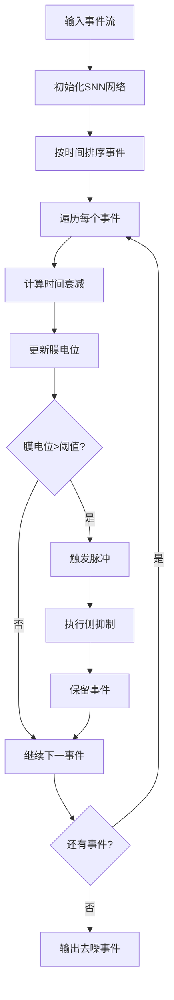

基于我对 `dataprocess/event_denoising.py` 文件中 `_snn_denoise` 方法的分析，我为您提供以下详细信息：

## SNN去噪方法详细分析

### 1. 算法原理

`_snn_denoise` 方法实现了一个基于脉冲神经网络的事件去噪算法，其核心思想来源于生物神经网络的工作机制：

#### 核心组件：
- **膜电位网络** (`network`): 模拟每个像素位置的神经元膜电位
- **时间网络** (`timenet`): 记录每个神经元最后一次更新的时间
- **触发计数** (`firing`): 记录神经元的触发次数
- **时间衰减机制**: 膜电位随时间自然衰减
- **侧抑制机制**: 触发后抑制周围区域的神经元

#### 算法流程：


### 2. 代码原型来源

从 `dataprocess/generate_action.py` 可以看到，这个SNN实现的原型来源于DVS Action数据集的处理代码。原始实现包含了更完整的SNN模型：

#### 原始SNN类的特点：
- **更大的网络尺寸**: `(260, 346)` 适配DVS相机分辨率
- **图像生成功能**: 将触发模式转换为灰度图像
- **形态学处理**: 使用膨胀和腐蚀操作优化输出
- **时间窗口处理**: 按固定时间间隔生成图像帧

### 3. 相关学术背景

虽然代码中没有直接引用具体论文，但这种SNN去噪方法基于以下学术原理：

#### 理论基础：
1. **生物神经网络模型**: 模拟真实神经元的膜电位动态
2. **侧抑制机制**: 来源于视觉皮层的竞争性抑制
3. **时间编码**: 利用事件的时间信息进行噪声过滤

#### 可能的相关论文方向：
- **事件相机去噪**: 专门针对DVS/事件相机的噪声处理方法
- **脉冲神经网络**: SNN在视觉处理中的应用
- **生物启发的视觉处理**: 模拟视网膜和视觉皮层的信息处理

### 4. 算法优势与特点

#### 优势：
- **时间感知**: 利用事件的时间信息进行智能过滤
- **空间相关性**: 通过侧抑制保持空间结构
- **自适应性**: 膜电位的动态更新适应不同的事件密度
- **生物合理性**: 基于真实神经网络的工作原理

#### 参数调优：
```python
# 关键参数及其作用
threshold = 1.2    # 触发阈值：控制敏感度
decay = 0.02       # 衰减率：控制时间记忆
margin = 3         # 侧抑制范围：控制空间抑制
spike_val = 1.0    # 脉冲值：每个事件的贡献
```

### 5. 实际应用效果

根据 `dataprocess/README_denoising.md` 的性能评估：

- **计算效率排序**: `simple` > `spatial_filter` > `temporal_filter` > `snn` > `combined`
- **去噪效果排序**: `combined` > `snn` > `temporal_filter` > `spatial_filter` > `simple`

SNN方法在去噪效果上表现优秀，但计算成本较高，适合对质量要求高的离线处理场景。

### 6. 代码原型总结

该SNN去噪实现是基于 `dataprocess/generate_action.py` 中的原始SNN类简化而来，保留了核心的膜电位更新、阈值触发和侧抑制机制，但去除了图像生成等额外功能，专注于事件流的去噪处理。这个实现体现了将生物神经网络原理应用于事件相机数据处理的核心思想，是一个很好的研究和应用起点。